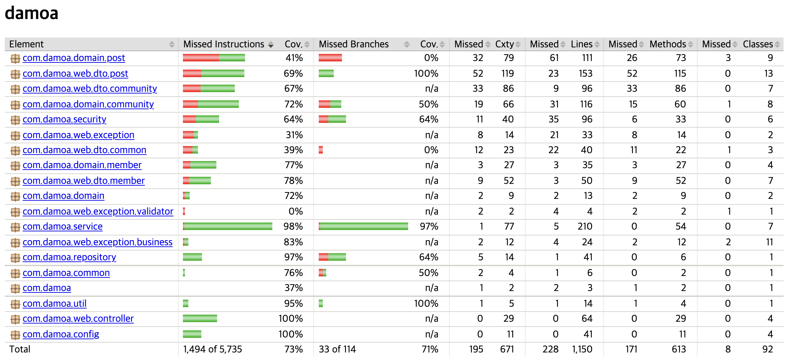

# Damoa API

## 소개
- Band.us 와 같은 모임형 커뮤니티
- JPA 성능 최적화
- 꾸준한 테스트 작성 (Jacoco 기준: branch coverage, instruction coverage 70% 이상 유지)
- RestDocs를 통한 API 문서 작성

## 기술 스택
- Java
- Spring Boot
- JPA
- Spring Security - JWT Token
- Spring Rest Docs
- Gradle
- MYSQL

## API 문서
https://jkjiwon.github.io/damoa-api-guide/

## Wiki 
1. [기능정의](https://github.com/JKjiwon/damoa/wiki/%5B1%5D.-기능-정의)
2. [JPA 최적화 전략](https://github.com/JKjiwon/damoa/wiki/%5B2%5D.-JPA-성능-최적화-전략)
3. [DB ERD](https://github.com/JKjiwon/damoa/wiki/%5B3%5D.-DB-ERD)
4. [Git 커밋 메세지](https://github.com/JKjiwon/damoa/wiki/%5B4%5D.-Git-커밋-메세지)

## 실행 방법
1. lombok 설치
2. application.yml 에 로컬 DB를 등록 후 실행

## JaCoCo Test Report
branch coverage, instruction coverage 70% 이상 유지

